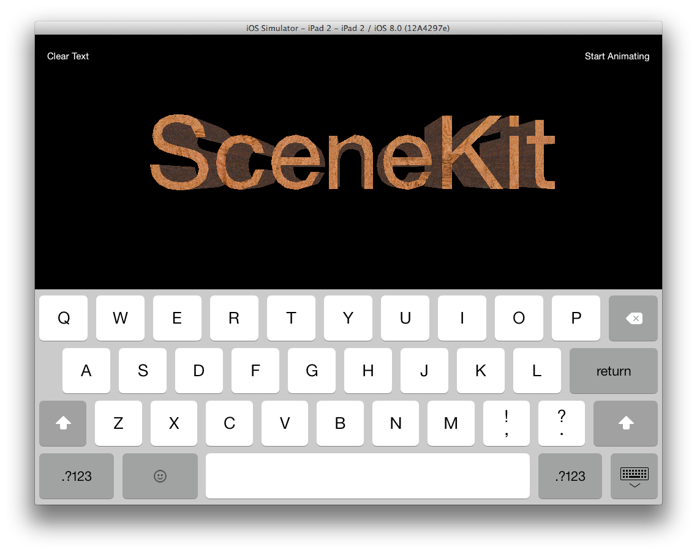

# SceneKit Demo

This is a little iOS 8 demo app I made for a talk at [dispatch_sync](http://dispatch-sync.com) in Portland in June, 2014. You can check out the slides from the talk in PDF form [here](https://dl.dropboxusercontent.com/u/575564/Justin%20Miller%20-%20dispatch_sync%20PDX%202014.pdf). 

The app uses a normal but hidden text field that the keyboard interacts with, then uses the text from that field as the input to an `SCNText` object in SceneKit, making 3D text. You can edit and clear the text, use pan and pinch gestures to move the camera around, tap on the text to increase the extrusion depth of the text, and toggle a little animation sequence which rotates the text. Or, you can try all of these in combination! 

